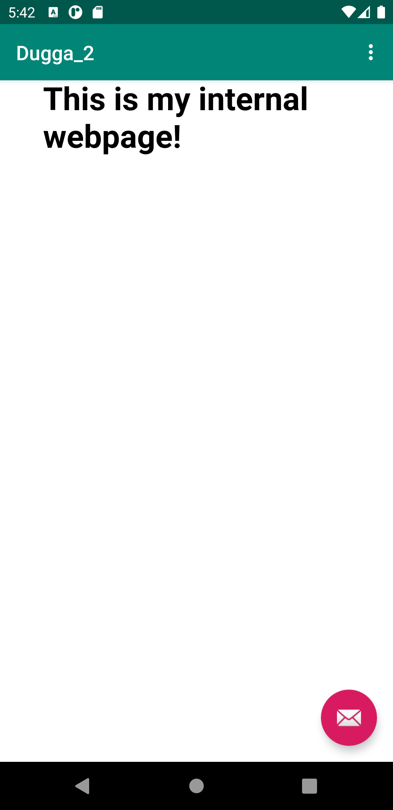
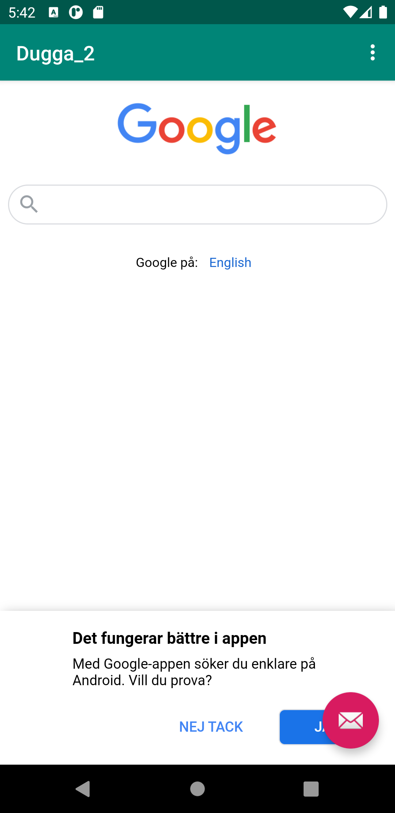

# Rapport

Jag började med att forka appen sedan öppna den i android studios.
Jag ändrade namn på appen i filen `strings.xml`.
Jag la till internetmöjlighet i `AndroidManifest.xml` filen som följade kodsnutt visar.

```xml
<uses-permission android:name="android.permission.INTERNET" />
```

Jag bytte sedan ut det text element som fanns i `content_main.xml` till mitt egna WebView element istället och instantierade det i `MainActivity`.

Jag instantierade mitt WebView objekt som finns i layout filen i koden genom att använda mig utav `findViewById(R.id.my_webview);` och därefter instantierade jag en WebViewClient och använder den i mitt WebView objekt. Sedan aktiverade jag möjligheten för javascript som syns i kodsnutten nedan.

```java
myWebview = findViewById(R.id.my_webview);

WebViewClient myWebViewClient = new WebViewClient();
myWebview.setWebViewClient(myWebViewClient);

WebSettings webSettings = myWebview.getSettings();webSettings.setJavaScriptEnabled(true);
```

För att använda en intern websida var jag tvungen att skapa en mapp för assets som jag sedan la en html fil i. Jag gjorde bara en simpel fil med text i.

För att få meny-valen att fungera som finns i menyn längst upp till höger i appen var jag tvungen att lägga till funktionerna `showExternalWebPage()` och `showInternalWebPage()` innuti if-taggarna som finns i funktionen `onOptionsItemSelected()` som visas i kod-snutten nedan.

```java
public boolean onOptionsItemSelected(MenuItem item) {
    ...

    if (id == R.id.action_external_web) {
        Log.d("==>","Will display external web page");
        showExternalWebPage();
        return true;
    }
    ...
}
```

Sedan la jag in `myWebView.loadUrl()` i respektive funktion för att visa extern och intern webplats.
Nedan är två screenshots från respektive intern och extern webplats.


